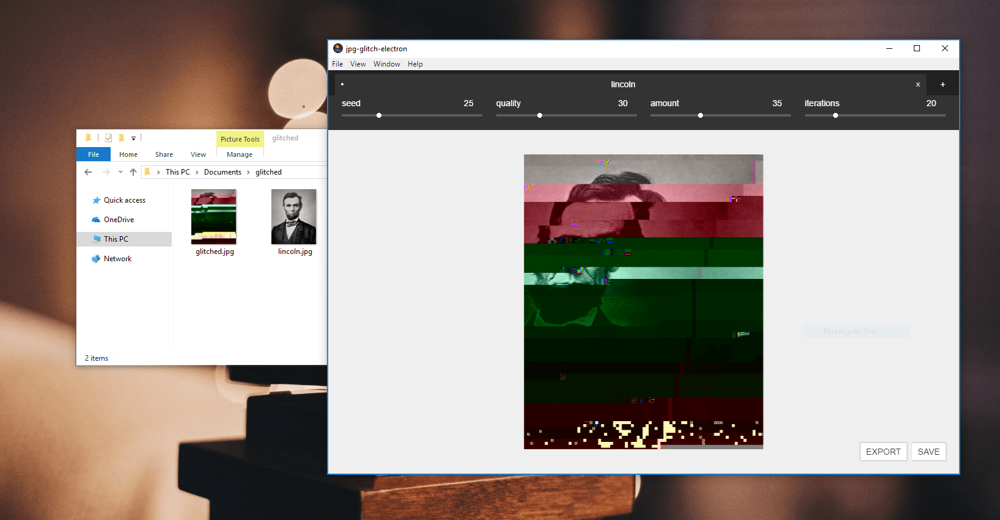

# JPG Glitch Electron

> An app for glitching images



This is the desktop app for [jpg-glitch](https://snorpey.github.io/jpg-glitch). You can use it to transform images so that appear glitched.

## Download
The following operating systems are supported:

_Please note:_ This software hasn't been extensively tested. Please [report](../../issues) any bugs you might encounter.

* [Windows](https://github.com/snorpey/jpg-glitch-electron/releases/download/v0.0.3/JPG.Glitch.Setup.0.0.3.exe)
* [macOS](https://github.com/snorpey/jpg-glitch-electron/releases/download/v0.0.3/JPG.Glitch-0.0.3.dmg)
* Linux: [AppImage](https://github.com/snorpey/jpg-glitch-electron/releases/download/v0.0.3/jpg-glitch-electron-0.0.3-x86_64.AppImage) / [deb](https://github.com/snorpey/jpg-glitch-electron/releases/download/v0.0.3/jpg-glitch-electron_0.0.3_amd64.deb) / [snap](https://github.com/snorpey/jpg-glitch-electron/releases/download/v0.0.3/jpg-glitch-desktop_0.0.3_amd64.snap) / [tar.gz](https://github.com/snorpey/jpg-glitch-electron/releases/download/v0.0.3/jpg-glitch-electron-0.0.3.tar.gz)


### Development

The app is built using [electron-vue](https://github.com/SimulatedGREG/electron-vue)@[1c165f7](https://github.com/SimulatedGREG/electron-vue/tree/1c165f7c5e56edaf48be0fbb70838a1af26bb015) Documentation about the original structure can be found [here](https://simulatedgreg.gitbooks.io/electron-vue/content/index.html).

#### Build Setup

This project has `node-canvas` as a dependency, which requires additional software to be installed.

``` bash
# install dependencies
npm install

# serve with hot reload at localhost:9080
npm run dev

# build electron application for production
npm run build

```

You can find installation instructions for building `node-canvas` are [here](https://github.com/Automattic/node-canvas), and special ones for windows [here](https://github.com/Automattic/node-canvas/wiki/Installation---Windows#install-with-chocolatey). 

These instructions may or may not work for you on the first try. If in doubt, delete the `node_modules` directory start a fresh install with `npm install`, and google any error messages. With persistance, you'll get there eventually.

When building on Linux, ensure that `snapcraft` and `snap core` are available and installed (or comment out the `snap` entry in `package.json`).
