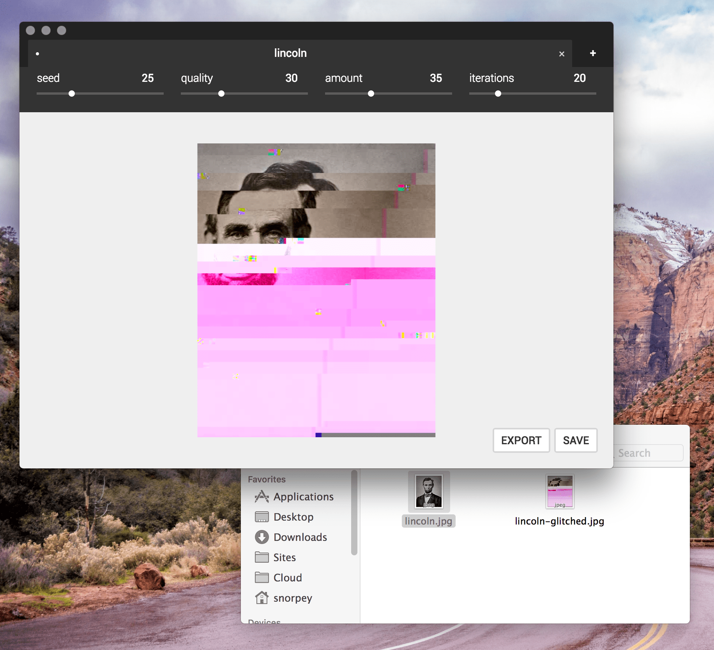

# JPG Glitch Electron

> An app for glitching images



You can use this app to transform images so that appear glitched.

This is a hybrid desktop + progressive web app for [jpg-glitch](https://snorpey.github.io/jpg-glitch).

You can either download a standalone app for your (desktop) operating or just open it in your browser: [
JPG Glitch](https://snorpey.github.io/jpg-glitch-electron)

## Download
The following operating systems are supported:

_Please note:_ This software hasn't been extensively tested. Please [report](../../issues) any bugs you might encounter.

* [Windows](https://github.com/snorpey/jpg-glitch-electron/releases/download/v0.1.3/JPG.Glitch.Setup.0.1.3.exe)
* [macOS](https://github.com/snorpey/jpg-glitch-electron/releases/download/v0.1.3/JPG.Glitch-0.1.3.dmg)
* Linux: [AppImage](https://github.com/snorpey/jpg-glitch-electron/releases/download/v0.1.3/JPG.Glitch-0.1.3.AppImage) / [deb](https://github.com/snorpey/jpg-glitch-electron/releases/download/v0.1.3/jpg-glitch-electron_0.1.3_amd64.deb) / [snap](https://github.com/snorpey/jpg-glitch-electron/releases/download/v0.1.3/jpg-glitch-electron_0.1.3_amd64.snap) / [tar.gz](https://github.com/snorpey/jpg-glitch-electron/releases/download/v0.1.3/jpg-glitch-electron-0.1.3.tar.gz)


### Development

The app is built using [vue-cli-plugin-electron-builder](https://nklayman.github.io/vue-cli-plugin-electron-builder).

#### Build Setup

This project has `node-canvas` as a dependency, which requires additional software to be installed.

``` bash
# install dependencies
npm install

# serve pwa with hot reload
npm run pwa:serve

# serve electron with hot reload
npm run electron:serve

# build the pwa and electron apps for production
npm run build

``` 

When building on Linux, ensure that `snapcraft` and `snap core` are available and installed (or comment out the `snap` target entry in `vue.config.js`).
